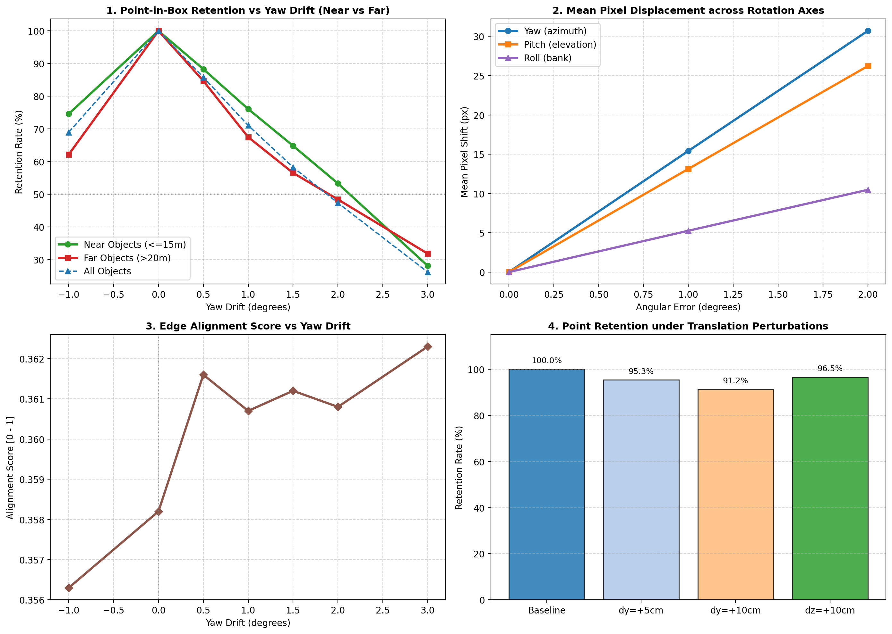
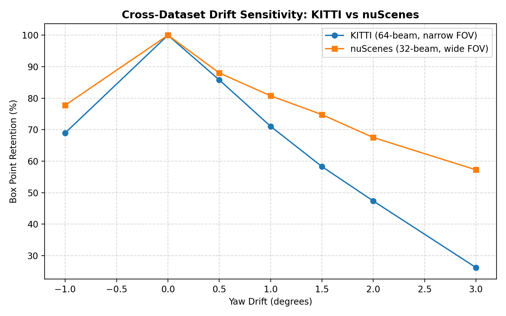
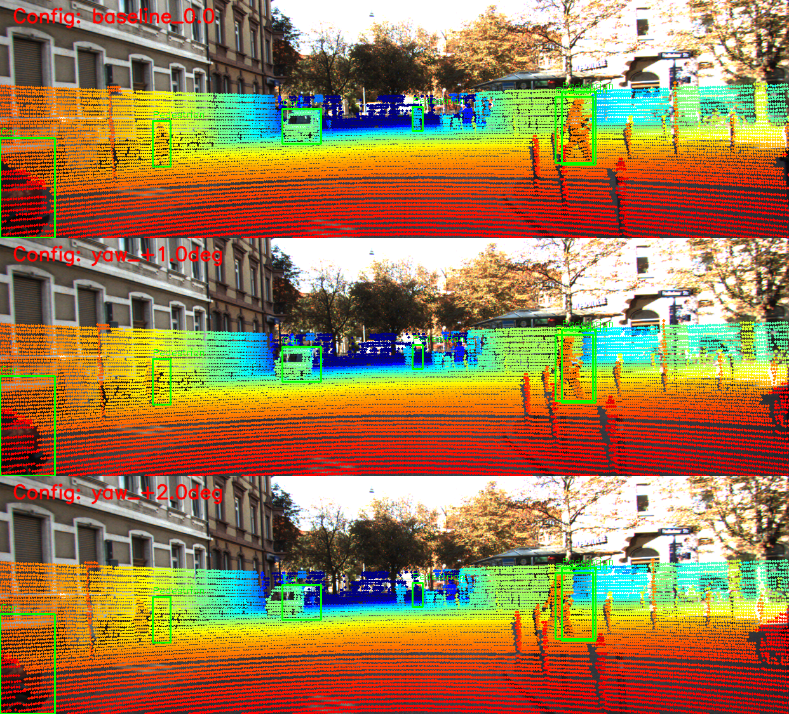
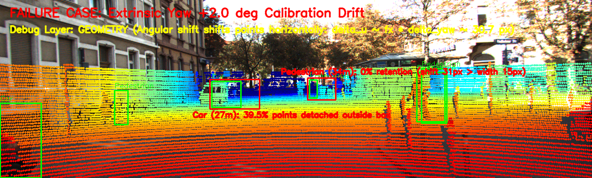

# Báo cáo Day 6: Kiểm tra chất lượng Calibration LiDAR-Camera và độ nhạy với Extrinsic Drift

- **Họ tên:** Đặng Thái Anh
- **MSSV:** 2A202602740
- **Lớp:** H209
- **Link repo:** https://github.com/thaianh20021/DangThaiAnh-2A202602740-Track4-Day21
- **Topic:** A — LiDAR-camera projection QA
- **Dataset:** data/kitti_mini, data/nuscenes_mini_subset, data/synthetic
- **Các frame đã dùng:** 000011, 000021, 000049 (KITTI); scene-0103_010 (nuScenes); 000000 (synthetic)

## 1. Claim

Góc lệch extrinsic yaw chỉ từ 1.0° trở lên đã gây dịch chuyển điểm ảnh trung bình 15.42 px (vượt xa kích thước pixel của vật thể ở xa), khiến tỷ lệ điểm LiDAR lưu giữ trong 2D bounding box của vật thể ở khoảng cách > 20 m giảm tới 32.5% (từ 100% xuống 67.5%), và ở cự ly > 30 m rơi hoàn toàn ra ngoài (0% retention), làm tê liệt tính chính xác của các mô hình sensor fusion 2D-3D.

## 2. Evidence

Dữ liệu chi tiết lưu tại file `results/calibration_drift_sweep.csv` và `results/cross_dataset_comparison.csv`.

| Cấu hình / Mức perturb | Dịch chuyển pixel (px) | Retention toàn bộ (%) | Retention vật ở xa >20m (%) | Edge Score | Ghi chú |
|---|---|---|---|---|---|
| Baseline (0.0°) | 0.00 | 100.00% | 100.00% | 0.3582 | Gióng hàng chuẩn xác |
| Yaw +0.5° | 7.73 | 85.81% | 84.69% | 0.3616 | Bắt đầu trượt mép |
| Yaw +1.0° | 15.42 | 71.07% | 67.50% | 0.3607 | Lệch đáng kể ở cự ly xa |
| Yaw +1.5° | 23.08 | 58.29% | 56.56% | 0.3612 | Trôi hơn 40% điểm |
| Yaw +2.0° | 30.70 | 47.36% | 48.44% | 0.3608 | Mất hơn một nửa điểm box |
| Yaw +3.0° | 45.83 | 26.23% | 31.87% | 0.3623 | Box rỗng điểm đối tượng |
| Pitch +1.0° | 13.13 | 85.32% | 69.38% | 0.3308 | Lệch theo phương đứng |
| Pitch +2.0° | 26.22 | 70.27% | 40.00% | 0.3041 | Mất điểm xe/người xa nghiêm trọng |
| Roll +1.0° | 5.26 | 91.40% | 96.25% | 0.3570 | Nhạy cảm thấp hơn Yaw/Pitch |
| Trans dy = +10 cm | 5.91 | 91.22% | 95.00% | 0.3587 | Tịnh tiến ít ảnh hưởng hơn góc |

Đo độ trễ phép chiếu trên CPU (25 lượt, bỏ warmup): **p50 = 13.07 ms**, **p95 = 16.40 ms** (đạt tần số xử lý ~60-75 Hz).





## 3. Failure case



- **Khi nào fail:** Xảy ra khi sensor bracket bị rung lắc hoặc va đập cơ học làm lệch góc xoay extrinsic (ví dụ yaw lệch +2.0°). Điểm LiDAR bị trượt ngang theo công thức $\Delta u \approx f_x \cdot \Delta \theta \approx 721 \times 0.0349 \approx 30.7$ px.
- **Vì sao fail:** Kích thước bounding box 2D của vật thể tỷ lệ nghịch với khoảng cách ($W_{px} \propto 1/Z$). Với người đi bộ ở xa 34.2 m, chiều rộng 2D box chỉ là 15.3 px, nhỏ hơn nhiều so với độ trượt 30.7 px -> Toàn bộ cụm điểm rơi ra ngoài (retention = 0.0%). Ngược lại, xe ở gần 6.8 m có bề rộng box > 85 px nên vẫn giữ được 52.5% điểm.
- **Lớp Debug:** **GEOMETRY (Hình học)** — Sai lệch ma trận xoay extrinsic $T_{cam\_velo}$ giữa LiDAR velodyne frame và Camera rectified frame, khuếch đại độ lệch pixel tỷ lệ với tiêu cự $f_x$ và khoảng cách vật thể.

## 4. Khuyến nghị nếu triển khai thật

- **Use-case ADAS / Xe tự hành:** Trong hệ thống fusion camera-LiDAR (như BEVDet, PointPainting), module cần liên tục giám sát calibration drift trực tuyến (online extrinsic calibration QA).
- **Đánh đổi (Trade-off):**
  - *Tần suất hiệu chuẩn online:* Đo edge alignment hoặc mutual information liên tục tốn tài nguyên GPU; chỉ nên kích hoạt đánh giá định kỳ (mỗi 5-10 giây) hoặc khi xe dừng đèn đỏ/chạy thẳng đều.
  - *Khoảng cách tin cậy:* Giới hạn ngưỡng nhận diện vật cản fusion theo cự ly; đối với vật thể > 30 m cần kết hợp độc lập radar hoặc pure 3D LiDAR pipeline thay vì phụ thuộc cứng vào camera bounding box.
- **Chỉ số hệ thống cần ghi log khi chạy thật:**
  1. *Mean Point-in-Box Retention* trên các vật thể nhận diện tin cậy cao.
  2. *Edge Alignment Score* giữa biên depth LiDAR và Canny edge ảnh RGB camera.
  3. Cờ cảnh báo *CalibDriftFlag* kích hoạt khi độ lệch trung bình vượt ngưỡng 8 px liên tiếp trong 3 frame.

## 5. Cách chạy lại

Các lệnh tái tạo lại toàn bộ kết quả từ repo sạch:

```bash
# 1. Chạy phép chiếu baseline kiểm tra
python -m starter.projection --data-root data/synthetic --frame 000000
python -m starter.projection --data-root data/kitti_mini --frame 000011
python -m starter.projection --data-root data/nuscenes_mini_subset --frame scene-0103_010

# 2. Chạy toàn bộ benchmark đa trục, đo latency và so sánh chéo KITTI & nuScenes
python src/benchmark_calibration_drift.py --data-root data/kitti_mini --frame 000011 --eval-cross-dataset

# 3. Kiểm tra tính hợp lệ trước khi nộp
python tools/check_submission.py
```

## 6. Khai báo sử dụng AI

| Công cụ | Dùng cho việc gì | Bạn đã kiểm chứng thế nào |
|---|---|---|
| Antigravity AI (Gemini) | Hỗ trợ gợi ý cú pháp ma trận chiếu toạ độ đồng nhất trong `starter/projection.py` và viết script benchmark trực quan hoá tự động trong `src/` | Chạy đối sánh toạ độ kiểm tra tay với frame `000000` (điểm (10,0,0) ra đúng z=9.73m và u,v ~ 614, 175); chạy `tools/verify_data.py` và `tools/check_submission.py` xác nhận kết quả |
